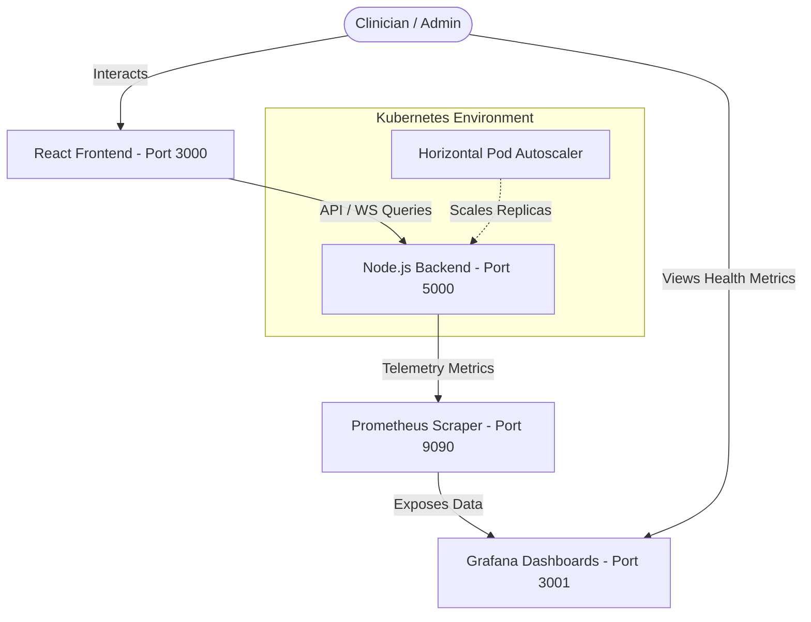

# Aspataal

> **Aspataal** is a real-time, clinical-grade Hospital Patient Vitals Monitoring & Anomaly Detection Platform. Built with Node.js, Express, React, Vite, Docker, and Kubernetes, it provides continuous streaming telemetry of patient health signals, triggers immediate warning/critical alert notifications, offers secure zero-knowledge PII auditing, and features a "chaos console" to stress-test your system's elasticity.

---

## 🏗️ System Architecture

Aspataal uses a decoupled architecture where the Frontend acts as a client dashboard, the Backend simulates patient vital statistics and exposes a Prometheus metric endpoint, and the telemetry stack (Prometheus & Grafana) provides visual diagnostics.



---

## ✨ Core Features

1. **Continuous Vital Telemetry**: Real-time heart rate, blood pressure, SpO2, and temperature updates generated dynamically by a deterministic simulation engine.
2. **Clinical Alert Engine**: Instantly flags abnormal signals and categorizes them into `WARNING` or `CRITICAL` levels based on medical thresholds.
3. **Zero-Knowledge PII Anonymization (Audit Mode)**: Opting into Audit Mode (via `X-Audit-Mode: true` header or `?audit=1` query) deterministic hashes patient names (SHA-256) and buckets patient ages (e.g., `40-49`) for k-anonymity, protecting patient privacy without interrupting vital streams.
4. **Clinical Playback System**: Features a black-box recording buffer that allows operators to scrub back in time second-by-second to reconstruct patient vital events.
5. **Chaos Testing Console**: Provides tools to simulate real-world emergency scenarios—including mass-casualty events, power outages, and vital surges—designed to trigger alerts and drive CPU loads to test Kubernetes scaling.

### 🩺 Normal Vitals Thresholds

The platform evaluates patient status using the following standard clinical bands:

| Vital Sign | Normal Min | Normal Max | Unit | Level Alert |
| :--- | :---: | :---: | :---: | :--- |
| **Heart Rate** | 60 | 100 | bpm | `<50` or `>120` (Critical) |
| **Blood Pressure** | 90 | 120 | mmHg | `<80` or `>140` (Critical) |
| **SpO2** | 95 | 100 | % | `<90%` (Critical) |
| **Temperature** | 36.5 | 37.5 | °C | `<35.0°C` or `>38.5°C` (Critical) |

---

## 🚀 How to Run Aspataal

You can spin up Aspataal using three different modes depending on your needs.

### Option A: Local Bare-Metal Development

#### Prerequisites
- Node.js (v18+ recommended)
- npm (v9+)

#### 1. Setup & Start Backend
```bash
cd backend
npm install
npm start
```
*The backend server will run on [http://localhost:5000](http://localhost:5000).*

#### 2. Setup & Start Frontend
```bash
cd ../frontend
npm install
npm run dev
```
*The frontend dashboard will run on [http://localhost:5173](http://localhost:5173).*

---

### Option B: Docker Compose Setup (Recommended)

To run the complete platform—including Prometheus and Grafana monitoring—Docker Compose is the easiest option.

#### Prerequisites
- Docker Desktop or Docker Engine with Compose plugin installed.

#### Run Command
In the root directory of the project, execute:
```bash
docker compose up --build -d
```

This launches 4 interconnected containers in a custom network bridge (`aspataal-net`):
- **Frontend App**: accessible at [http://localhost:3000](http://localhost:3000)
- **Backend Service**: accessible at [http://localhost:5000](http://localhost:5000)
- **Prometheus Server**: accessible at [http://localhost:9090](http://localhost:9090)
- **Grafana Server**: accessible at [http://localhost:3001](http://localhost:3001)

To tear down the environment:
```bash
docker compose down
```

---

### Option C: Kubernetes Deployment

For production-mimicking deployments, Kubernetes manifests are provided under the `/k8s` directory. It sets up deployments, node port services, and a Horizontal Pod Autoscaler (HPA).

#### Prerequisites
- A running Kubernetes cluster (Minikube, Kind, or Docker Desktop Kubernetes)
- `kubectl` configured to your cluster context.

#### Deploy Commands
1. Apply the manifests:
   ```bash
   kubectl apply -f k8s/
   ```
2. Verify pods and services:
   ```bash
   kubectl get pods -A
   kubectl get svc
   ```
3. Access the application:
   - **Frontend App**: Accessible via NodePort on port `30000` (e.g., `http://localhost:30000`).
   - **Backend Service**: Accessible via NodePort on port `30001` (e.g., `http://localhost:30001`).

*Note: The HPA monitors CPU utilization on the backend pods. When Chaos Console tests are triggered, it spins up additional backend replicas (up to 5 pods).*

---

## 📊 Grafana and Prometheus Integration

Aspataal exposes native Prometheus metrics at `/metrics` from the backend service. Follow these steps to set up your monitoring dashboard.

### Step 1: Open Grafana
1. Navigate to [http://localhost:3001](http://localhost:3001).
2. Login using the default administrator credentials:
   - **Username**: `admin`
   - **Password**: `admin`
3. If prompted to change the password, you may update it or click **Skip**.

### Step 2: Add Prometheus Data Source
1. Click on the **Menu icon** (three horizontal lines) in the top-left, hover over **Connections**, and select **Data sources**.
2. Click **Add data source**.
3. Select **Prometheus** from the list of options.
4. Set the **Connection URL**:
   - **Docker Compose Mode**: Enter `http://prometheus:9090` (since both run on the docker-compose bridge).
   - **Local Bare-Metal Mode**: Enter `http://localhost:9090`.
5. Scroll down to the bottom of the page and click **Save & test**. You should see a green checkmark saying "Data source is working".

### Step 3: Import the Dashboard
1. Click on the **Menu icon**, select **Dashboards**.
2. Click **Create** (dropdown in top-right of Dashboards screen) and choose **Import**.
3. You can either:
   - Copy the contents of the file [grafana-dashboard.json](file:///c:/Users/hps/Downloads/aspataal-main/aspataal-main/monitoring/grafana-dashboard.json) and paste it into the **Import via panel json** box.
   - Click **Upload JSON file** and select the `monitoring/grafana-dashboard.json` file.
4. Select the **Prometheus** data source you just added in the previous step.
5. Click **Import**.

---

## 📈 Exposed Telemetry Metrics

Once connected, you will be able to monitor the following metrics inside the dashboard:

| Metric Name | Type | Description |
| :--- | :---: | :--- |
| `aspataal_active_alerts_total` | Gauge | The current number of active WARNING/CRITICAL patient alerts. |
| `aspataal_critical_alerts_total` | Counter | Total number of critical alerts triggered since server startup. |
| `aspataal_warnings_total` | Counter | Total number of warnings triggered since server startup. |
| `aspataal_patients_monitored` | Gauge | Total number of patients currently admitted. |
| `aspataal_api_requests_total` | Counter | Total throughput of API requests hitting the backend server. |
| `aspataal_sim_speed_multiplier` | Gauge | Speed of the simulation engine (used to view stress metrics during chaos tests). |

---

## 🧪 Chaos Testing & Scaling Verification
To see the metrics and Kubernetes autoscaler in action:
1. Access the **Chaos Console** from the frontend dashboard.
2. Trigger a **Mass Admission** or crank up the **Simulation Speed** to `10x`.
3. Watch Grafana in real-time. You will see spikes in `aspataal_api_requests_total` and CPU usage.
4. If running on Kubernetes, verify with `kubectl get hpa` to watch the backend pods autoscale dynamically.
